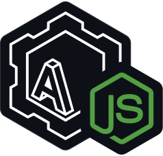

    

# adae-node

This library provides JavaScript and TypeScript bindings for the Adae audio engine, in the form of a Node-API native addon.
This unfortunately means that it is not compatible with browsers, or any other environment that does not support the Node-API.

The Node-API is supported in:
- Node.js
- Electron
- Deno (partially)
- Bun (partially)

The library is implemented on top of [Neon](https://github.com/neon-bindings/neon#readme), so please refer to that for more granular information about supported platforms etc.
